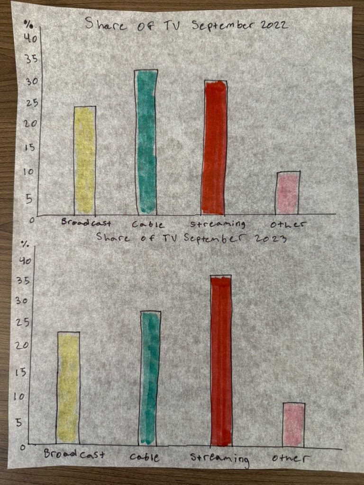

Links to stories

[https://www.nielsen.com/insights/2023/sports-gave-broadcast-channels-a-second-straight-month-of-viewing-gains-in-september/]([url](https://www.nielsen.com/insights/2023/sports-gave-broadcast-channels-a-second-straight-month-of-viewing-gains-in-september/))
[https://www.candystore.com/blogs/holidays/valentines-candy-popular-states]([url](https://www.candystore.com/blogs/holidays/valentines-candy-popular-states))

Links to new data visualizations

For the above chart I changed it from a pie chart and a monthly bar chart to two bar charts to make it more simple to understand.

For the above chart, I changed from a bar chart showing change over time to a dot plot that shows change over time even better.
